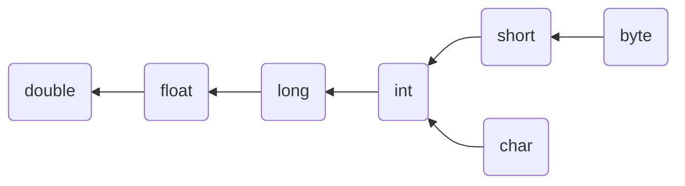
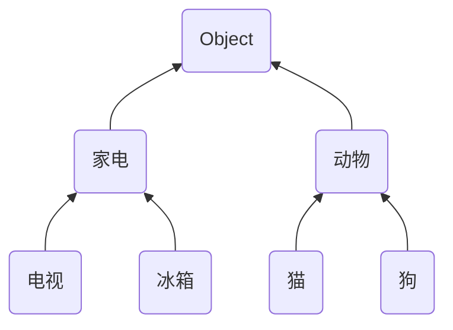
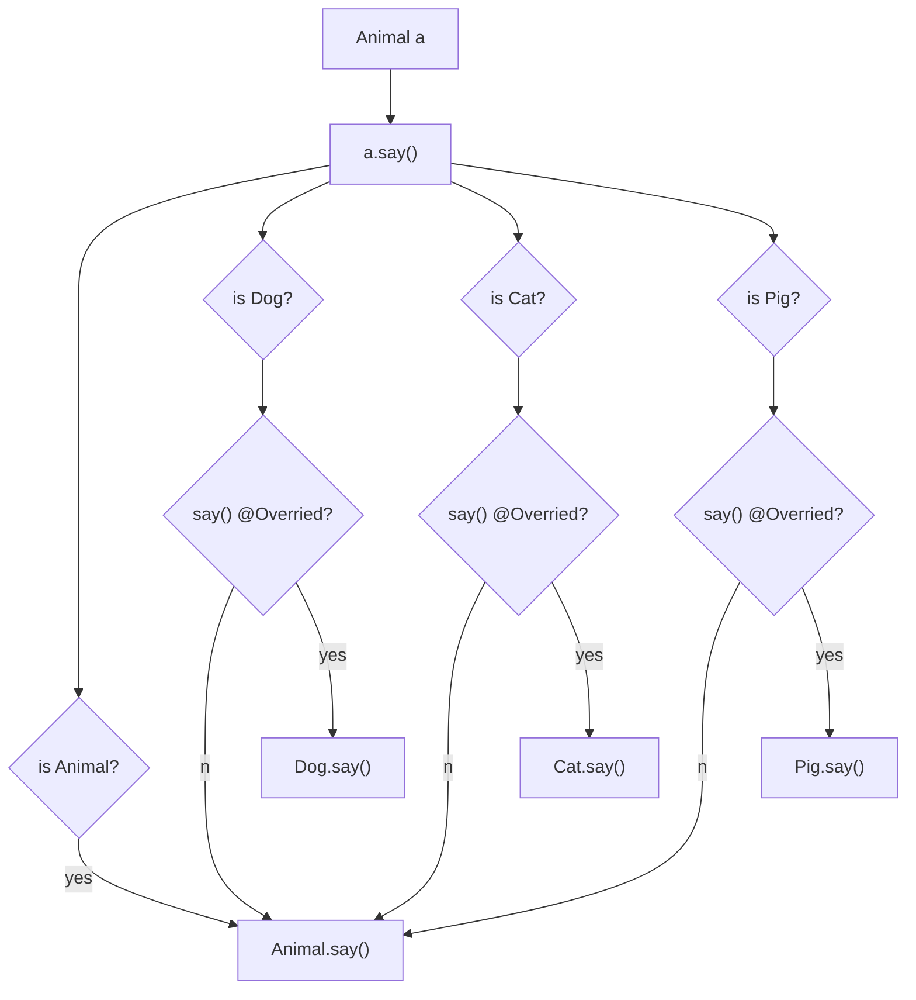
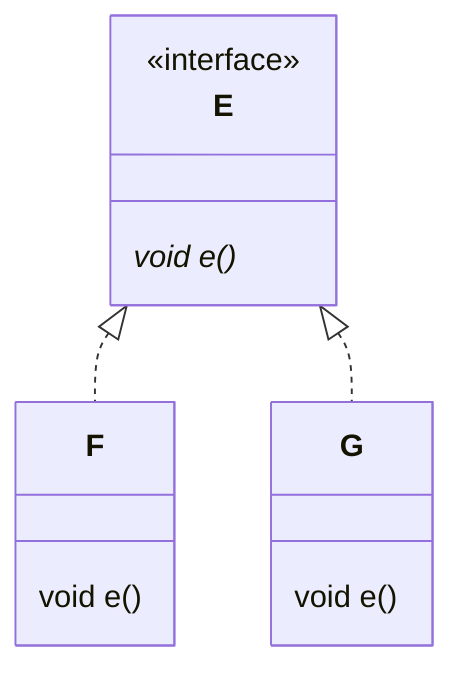
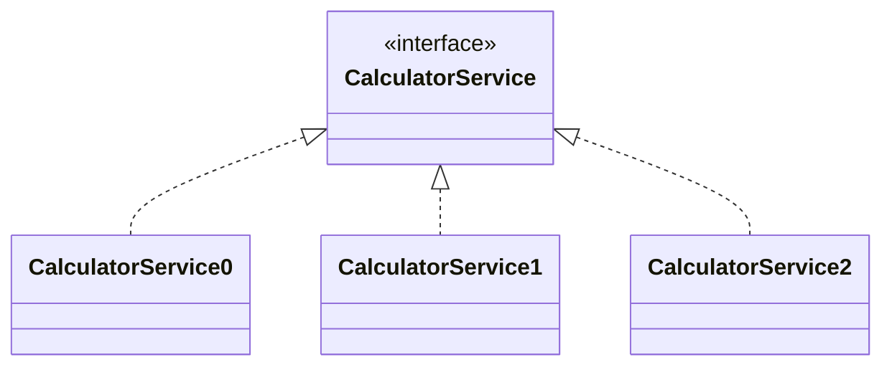
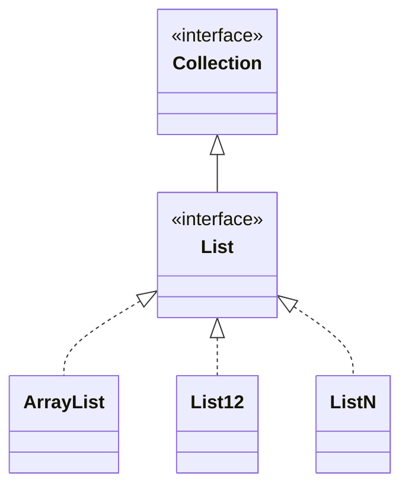
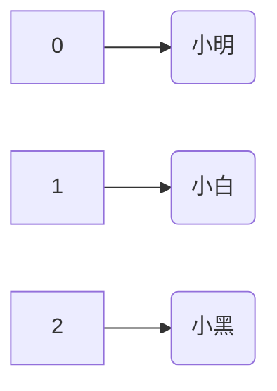
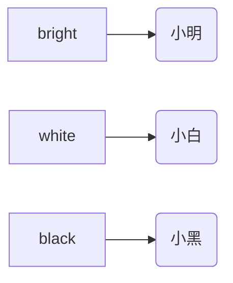
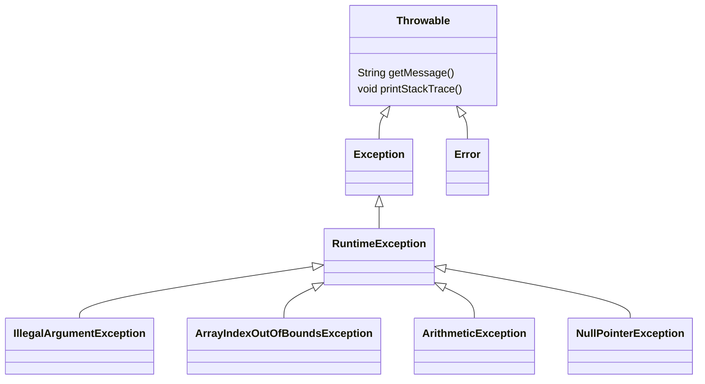

# 一. 什么是对象

什么是对象？之前我们讲过，对象就是计算机中的虚拟物体。例如 System.out，System.in 等等。然而，要开发自己的应用程序，只有这些现成的对象还远远不够。需要我们自己来创建新的对象。

例如，我想开发一个电商应用，在网上卖手机，打算使用对象来代表这些手机。怎么做呢？首先要对现实世界的手机进行**抽象**，抽取它属性、抽取它的行为

## 1. 抽取属性

抽取时要抓取本质属性，在真实物体上做简化，并不是所有的属性都要抽象

* 例如对于手机来说，分析最终的展示效果可以得知，需要品牌、内存、大小、颜色、价格，其它页面展示用不上的属性，就不必抽取了

* 这些属性信息在 java 里称为对象的**字段**，根据它们，我们就能确定这个对象将来长什么样，相当于给对象定义了模板，模板一旦确定，再创建的对象就不能跳出模板的范围。

* 模板有了，就可以根据它创建各种各样的手机对象，比如
  * 手机1，品牌苹果、内存128G、大小6.1英寸、颜色星光色、价格5799
    * 可以看到，对象的字段要和模板定义的是一模一样的，不能多也不能少

  * 手机2，品牌红米、内存4G、大小6.53英寸、颜色金色、价格1249
  * 手机3，品牌华为、内存4G、大小6.3英寸、颜色幻夜黑、价格999

* 这个模板，以后在 java 里称之为类，英文 class，这些对象呢，英文也要知道：object


代码里怎么表示类呢，看一下类的语法

```java
class 类 {
    字段;
    
    构造方法(参数) {
        
    }
    
    返回值类型 方法名(参数) {
        代码
    }
}
```

* 字段定义与之前学过的局部变量、方法参数的定义类似，它们本质都是变量

* 构造方法也是一种方法，在将来创建对象时被使用，作用是为对象字段赋初始值
  * 构造方法与类同名，不用加返回值类型声明

* 从属于对象的方法不用 static 修饰，它就代表对象的行为，这里先放一下


就以刚才的手机为例，按照语法写一下

```java
public class Phone {
    // 类型 名字
    String brand; // 品牌
    String memory; // 内存
    String size; // 大小
    String color; // 颜色
    double price; // 价格

    public Phone(String b, String m, String s, String c, double p) {
        brand = b;
        memory = m;
        size = s;
        color = c;
        price = p;
    }
}
```


有了类，才能创建对象，创建对象的语法

```java
new 类构造方法(参数)
```


例如

```java
public class TestPhone {
    public static void main(String[] args) {
        Phone p1 = new Phone("苹果", "128G", "6.1寸", "星光色", 5799.0);
        Phone p2 = new Phone("红米", "4G", "6.53寸", "金色", 1249.0);
        Phone p3 = new Phone("华为", "4G", "6.3寸", "幻夜黑", 999.0);
        
        System.out.println(p1.color); // 获取p1的颜色
		System.out.println(p1.price); // 获取p1的价格
        
        p1.price = 3000.0;			  // 修改p1的价格
		System.out.println(p1.price); // 获取p1的价格
    }
}
```

* 前面的变量  p1、p2、p3 分别代表了这三个手机对象（也可以理解为给对象起了个名字）
* 想知道第一个手机的颜色和价格，就使用 p1.color 和 p1.price 来获取
* 想把第一个手机的价格做出优惠，就给 p1.price 赋个新值


总结一下：

* 类是对象的模板，用字段描述对象将来长什么样，用构造给字段变量赋值
* 对象说白了，就是一组数据的集合，但这些数据不是乱写的，有什么，不该有什么，得按类的规则来


## 2. 字段默认值

如果字段没有通过构造方法赋值，那么字段也会有个默认值

| 类型                     | 默认值 | 说明 |
| ------------------------ | ------ | ---- |
| byte short int long char | 0      |      |
| float double             | 0.0    |      |
| boolean                  | false  |      |
| 其它                     | null   |      |

比如说，想加一个字段 available 表示手机上架还是下架，这时就可以使用默认值统一设置

```java
public class Phone {
    // 类型 名字
    String brand; // 品牌
    String memory; // 内存
    String size; // 大小
    String color; // 颜色
    double price; // 价格
    boolean available; // 是否上架

    public Phone(String b, String m, String s, String c, double p) {
        brand = b;
        memory = m;
        size = s;
        color = c;
        price = p;
    }
}
```

* 构造方法里不对 available 字符赋值，默认为下架（false）
* 要设置为默认上架（true）可以给字段直接赋值为 true 或在构造方法里给它赋值为 true


## 3. this

对于变量的命名，包括方法参数的命名，最好做到见文知义，也就是起名的时候起的更有意义，最好能一眼看出来这个变量它代表什么，你来看手机构造方法这些参数的名字起的好不好？不好吧，这样改行不行（先只改一个 brand）：

```java
public class Phone {
    // 类型 名字
    String brand; // 品牌
    String memory; // 内存
    String size; // 大小
    String color; // 颜色
    double price; // 价格
    boolean available; // 是否上架

    public Phone(String brand, String m, String s, String c, double p) {
        brand = brand;
        memory = m;
        size = s;
        color = c;
        price = p;
    }
}
```

* 等号右侧的 brand，对应的是方法参数中的 brand 的吧
* 等号左侧的 brand 呢，它对应的也是方法参数中的 brand，并非对象的 brand 字段

当方法参数与字段重名时，需要用在字段前面加 this 来区分

```java
public class Phone {
    // 类型 名字
    String brand; // 品牌
    String memory; // 内存
    String size; // 大小
    String color; // 颜色
    double price; // 价格
    boolean available; // 是否上架

    public Phone(String brand, String memory, String size, String color, double price) {
        this.brand = brand;
        this.memory = memory;
        this.size = size;
        this.color = color;
        this.price = price;
        this.available = true;
    }
}
```

* 前面有 this 的 brand 对应的是字段的 brand，前面没有 this 的 brand 对应的是方法参数中的 brand
* this 代表对象自己，但只能在构造方法、对象方法中使用
* 没有重名的情况下可以省略 this

>提示
>
>* 如果觉得自己写 this 比较麻烦，可以使用 IDEA 的快捷键 ALT + Insert 来生成构造方法
>* 用 IDEA 生成的构造方法字段和方法参数都是用 this 区分好的


## 4. 无参构造

带参数的构造并不是必须的，也可以使用无参构造，例如

```java
public class Student {
    String name;    // 姓名   null
    int age;        // 年龄   0

    Student() {

    }
}
```

使用无参构造创建对象示例如下

```java
public class TestStudent {
    public static void main(String[] args) {
        Student s1 = new Student();
        s1.name = "张三";
        s1.age = 18;

        System.out.println(s1.name);
        System.out.println(s1.age);
    }
}
```

* 字段赋值现在不是构造方法内完成了，而是先创建了对象
* 再通过【对象.字段】来赋值，最终赋值效果是一样的

无参构造有个特性：

* 当 Java 在编译这个类时，发现你没有提供任何构造方法，它就会给你提供一个无参构造
* 如果你已经提供了带参构造方法，Java 就不会主动提供无参构造了


## 5. 抽取行为

前面我们讲了，面向对象编程，就是抽象现实世界的物体把它表示为计算机中的对象，手机的例子中，我们定义了类，抽取了字段来描述对象长什么样，这节课我们继续来抽取方法描述这个对象的行为，方法决定了这个对象能干什么

手机的例子不需要方法，计算机中的手机是假的，没法打电话，下面举一个有方法的例子

这里使用了 javascript 语言来举这个例子，虽然大家没有学过这门语言，但它的语法与 java 非常类似，相信我解释一下大家就能理解，另外，我待会讲解时，咱们把注意力集中的类和方法这部分代码上，其它一些 javascript 语言的细节也不用去关注

```js
class Car {
    constructor(color, speed, x, y) {
        this.color = color;  // 颜色
        this.speed = speed;  // 速度
        this.stopped = true;  // 是否停止
        this.x = x;
        this.y = y;
    }
    run() {
        this.stopped = false;
    }
    // 更新坐标
    update() {
        
    }
    // 省略其它无需关注的代码
}
```

* class 也是定义一个类，这里是一个汽车类
* 页面上能看到根据这个类创建出的一个个汽车对象，白的汽车、灰的汽车、黑的汽车
* constructor 是 js 中的构造方法，也是用来给 js 对象的字段赋初值
  * this.color 是汽车对象的颜色字段
  * this.speed 是汽车对象的速度字段
  * this.stopped 是汽车是否停止
  * this.x 和 this.y 是控制汽车在屏幕上的坐标
    * 坐标以画布的左上角为原点，向右是 x 轴正向，向下是 y 轴正向
    * x, y 的初始值怎么来的，这个我隐藏了，大家不用关注


创建汽车对象的语法与 java 几乎是一样的：

```js
new Car("red", 5); // 这是创建一个红色的，速度为 5 的汽车
new Car("blue", 4); // 这是创建一个蓝色的，速度为 4 的汽车
```

执行完上两行创建汽车对象，页面效果如下所示


网页上的汽车不能动啊，方法要登场了！方法就是用来控制对象的行为

主要来看这个 update 方法，update 方法的作用，被我设计为控制汽车的坐标，你只需要把坐标如何变化通过代码在update里写出来，就能看到效果

```js
update() {
    if(this.stopped) {
        return;
    }
    this.y -= this.speed;
    if (this.y <= 20) {
        this.y = 20;
    }
}
```

* 假设只能向上跑，每次调用方法时让 this.y 减少，减少多少呢？

  * 固定成 3，但这样大家速度都一样了
  * 改为根据 this.speed 减少

  * 假设顶端是终点，this.y 不能超过终点，因此加一个 if 判断，如果小于 0 则固定为 0
  * 因为汽车的 y 坐标是以矩形底部开始算的，0 会导致汽车跑出了画面，所以汽车跑到终点时 y 坐标应改为20，也就是汽车长度
* 汽车没有听我命令就一开始就跑了，this.stopped 控制这个汽车是停还是移动

  * 在更新坐标里加个判断 this.stopped 为 false 才跑


通过这个例子，我们应当知道，方法的作用是控制对象的行为


# 二. 对象演化

更专业的说

* 对象由数据（data）和代码（code）组成
  * data 有很多称呼：fields（字段），attributes（属性），properties（属性），
    * 很多的资料都称为属性，但 properties 后面在学 java bean 时会有额外的意义，因此我这儿还是称之为字段吧，以便后面区分
  * code 也有多种称呼：procedures（过程），methods（方法），functions（函数），我们称之为方法吧


例如

我的需求是，对比相同本金，不同利率和贷款月份，计算总还款额，看哪个更划算一些

* 4.5% 利率借2年
* 6.0% 利率借1年

不用面向对象方式，写出来的代码长这样

```java
public class TestCal {
    public static void main(String[] args) {
        // 对比相同本金，不同利率和贷款月份，计算总还款额(等额本息)，看哪个更划算一些
		double p1 = 100000.0;
		int m1 = 24;
		double yr1 = 4.5;
		double r1 = cal(p1, m1, yr1);
        System.out.println("4.5% 利率借 2 年：" + r1);

		double p2 = 100000.0;
		int m2 = 12;    // 1 年
		double yr2 = 6.0;
		double r2 = cal(p2, m2, yr2);
        System.out.println("6.0% 利率借 1 年：" + r2);
    }

    static double cal(double p, int m, double yr) {
        double mr = yr / 100.0 / 12;
        double pow = Math.pow(1 + mr, m);
        return m * p * mr * pow / (pow - 1);
    }
}
```


## 1. 对象字段演化

那么将来对象从何而来呢？很简单，找关系！把一组相关的数据作为一个整体，就形成了对象。

我们现有的数据中，哪些是相关的？

* 4.5、24、100000.0 这些数据为一组，**封装**成 Calculator c1 对象
* 6.0、12、100000.0 这些数据为一组，**封装**成 Calculator c2 对象

代码变成了下面的样子

```java
public class Cal {
    double p;
    int m;
    double yr;

    public Cal(double p, int m, double yr) {
        this.p = p;
        this.m = m;
        this.yr = yr;
    }
}

public class TestCal {
    public static void main(String[] args) {
        // 对比相同本金，不同利率和贷款月份，计算总还款额(等额本息)，看哪个更划算一些
		Cal c1 = new Cal(100000.0, 24, 4.5);
		double r1 = cal(c1);
        System.out.println("4.5% 利率借 2 年：" + r1);

		Cal c2 = new Cal(100000.0, 12, 6.0);
		double r2 = cal(c2);
        System.out.println("6.0% 利率借 1 年：" + r2);
    }

    static double cal(Cal c) {
        double mr = c.yr / 100.0 / 12;
        double pow = Math.pow(1 + mr, c.m);
        return c.m * c.p * mr * pow / (pow - 1);
    }
}
```

* 计算时，把这里的 c1, c2 传递过去。方法也变成了只需要一个 Calculator 参数，因为它一个参数，能顶原来三个参数，方法内部需要的数据来自于对象的字段。
* 注意方法此时还是用的 static  方法，方法这别着急，马上讲


总结：把相关的数据作为一个整体，就形成了对象，对象的字段演化完毕


## 2. 对象方法演化

方法执行总得需要一些数据，以前我们学习的主要是这种 static 方法，它的数据全部来自于方法参数。

今天开始，要学习对象方法，顾名思义，它是**从属于**对象的方法，语法上要去掉 static，变成这个样子

```java
public class Cal {

    double p;
    int m;
    double yr;

    public Cal(double p, int m, double yr) {
        this.p = p;
        this.m = m;
        this.yr = yr;
    }

    double cal() {
        double mr = yr / 100.0 / 12;
        double pow = Math.pow(1 + mr, m);
        return m * p * mr * pow / (pow - 1);
    }
}
```

看看改动成对象方法后，都有哪些代码发生了变化？为啥不需要参数了呢？

这种对象方法执行需要的数据：

* 一部分来自于方法参数
* 另一部分来自于方法从属的对象

既然我们讲的这种对象方法都**从属于** Calculator 对象了，那么方法参数这里是不是就没必要再加一个 Calculator 对象了啊

方法体内这些本金、月份、利率，都来自于方法所从属的对象的字段。不用写前面的 c. 了

* 当然，我们这个例子中，本金、月份、利率，在方法所从属的那个 Calculator 对象中已全部包含，因此方法上也无需更多其它参数。如果方法执行的有些数据，对象未包含，那你还是得添加方法参数

  

最后，方法调用时，为了表达与对象的这种从属关系，格式也应变化为：对象.方法()

```java
public class TestCal {
    public static void main(String[] args) {
        // 对比相同本金，不同利率和贷款月份，计算总还款额(等额本息)，看哪个更划算一些
        Cal c1 = new Cal(100000.0, 24, 4.5);
        double r1 = c1.cal();
        System.out.println("4.5% 利率借 2 年：" + r1);
        
        Cal c2 = new Cal(100000.0, 12, 6.0);
        double r2 = c2.cal();
        System.out.println("6.0% 利率借 1 年：" + r2);
    }
}
```

例如：

* c1.cal() 执行时，cal 方法就知道，我执行需要的 y，m，yr 这些数据来自于 c1 对象
* c2.cal() 执行时，cal 方法就知道，我执行需要的 y，m，yr 这些数据来自于 c2 对象


对象的方法演化完毕


> 静态方法 vs 对象方法
>
> * 而 static 方法需要的数据，全都来自于方法参数，它没有关联对象，没有对象的那一部分数据
> * 对象方法执行的数据，一部分数据从方法参数转移至对象内部


## 3. 贷款计算器 - 对象改造

用面向对象思想设计等额本息和等额本金两个类

```java
class Calculator0 {
    Calculator0(double p, int m, double yr) {
        this.p = p;
        this.m = m;
        this.yr = yr;
    }

    double p;
    int m;
    double yr;    

    String[] cal0() {
        double mr = yr / 12 / 100.0;
        double pow = Math.pow(1 + mr, m);
        double payment = p * mr * pow / (pow - 1);
        return new String[]{
                NumberFormat.getCurrencyInstance().format(payment * m),
                NumberFormat.getCurrencyInstance().format(payment * m - p)
        };
    }

    String[][] details0() {
        String[][] a2 = new String[m][];
        double mr = yr / 12 / 100.0;
        double pow = Math.pow(1 + mr, m);
        double payment = p * mr * pow / (pow - 1);              // 月供
        for (int i = 0; i < m; i++) {
            double payInterest = p * mr;                        // 偿还利息
            double payPrincipal = payment - payInterest;        // 偿还本金
            p -= payPrincipal;                                  // 剩余本金
            String[] row = new String[]{                       // 一行的数据
                    (i + 1) + "",
                    NumberFormat.getCurrencyInstance().format(payment),
                    NumberFormat.getCurrencyInstance().format(payPrincipal),
                    NumberFormat.getCurrencyInstance().format(payInterest),
                    NumberFormat.getCurrencyInstance().format(p)
            };
            a2[i] = row;
        }
        return a2;
    }
}
```


```java
class Calculator1 {

    Calculator1(double p, int m, double yr) {
        this.p = p;
        this.m = m;
        this.yr = yr;
    }

    double p;
    int m;
    double yr;

    String[] cal1() {
        double payPrincipal = p / m;        // 偿还本金
        double backup = p;                  // 备份本金
        double mr = yr / 12 / 100.0;
        double payInterestTotal = 0.0;      // 总利息
        for (int i = 0; i < m; i++) {
            double payInterest = p * mr;    // 偿还利息
            p -= payPrincipal;              // 剩余本金
            payInterestTotal += payInterest;
        }
        // [0]还款总额   [1]总利息
        return new String[]{
                NumberFormat.getCurrencyInstance().format(backup + payInterestTotal),
                NumberFormat.getCurrencyInstance().format(payInterestTotal)
        };
    }

    String[][] details1() {
        double payPrincipal = p / m;                        // 偿还本金
        double mr = yr / 12 / 100.0;
        String[][] a2 = new String[m][];
        for (int i = 0; i < m; i++) {
            double payInterest = p * mr;                    // 偿还利息
            p -= payPrincipal;                              // 剩余本金
            double payment = payPrincipal + payInterest;    // 月供
            String[] row = new String[]{
                    (i + 1) + "",
                    NumberFormat.getCurrencyInstance().format(payment),
                    NumberFormat.getCurrencyInstance().format(payPrincipal),
                    NumberFormat.getCurrencyInstance().format(payInterest),
                    NumberFormat.getCurrencyInstance().format(p)
            };
            a2[i] = row;
        }
        return a2;
    }
}
```


控制器代码则变为，比以前看着也简洁了不少

* 对象封装了数据，方法封装了计算逻辑，**封装**，这是面向对象的好处之一
* 面向对象编程，并不能做出更强大的功能，只是改变的代码的结构

```java
@Controller
public class CalController {
    
    @RequestMapping("/cal")
    @ResponseBody
    String[] cal(double p, int m, double yr, int type) {
        if (type == 0) { // 等额本息
            return new Calculator0(p, m, yr).cal0();
        } else {    // 等额本金
            return new Calculator1(p, m, yr).cal1();
        }
    }

    @RequestMapping("/details")
    @ResponseBody
    String[][] details(double p, int m, double yr, int type) {
        if (type == 0) {
            return new Calculator0(p, m, yr).details0();
        } else {
            return new Calculator1(p, m, yr).details1();
        }
    }
}
```


## 4. 静态变量

下面是对圆、计算圆面积进行了面向对象设计

```java
public class Circle {

    double r; // 半径
    double pi = 3.14;

    public Circle(double r) {
        this.r = r;
    }
    
    double area() {
        return pi * r * r;
    }
}
```

测试代码如下

```java
public class TestCircle {
    public static void main(String[] args) {
        Circle c1 = new Circle(1.0);
        c1.pi = 3.14;
        Circle c2 = new Circle(1.0);
        c2.pi = 3;

        System.out.println(c1.area()); // 圆的面积计算结果为 3.14
        System.out.println(c2.area()); // 圆的面积计算结果为 3

    }
}
```

这显然不合理，不能一个圆计算时 $\pi$ 值是 3.14，换成另一个圆计算时 $\pi$ 值就变成了 3，对于 $\pi$ 值来讲，应该是所有圆共享一个值

* 你看，对于将来千千万万个圆对象来说，它们各有各的半径
* 但无论圆有多少个，3.14 这个数，只需要有一个就足够了


改进如下

```java
public class Circle {

    double r; // 半径
    static double pi = 3.14; // 静态变量, 所有圆对象共享它

    public Circle(double r) {
        this.r = r;
    }
    
    double area() {
        return pi * r * r;
    }
}
```

回到测试代码

```java
public class TestCircle {
    public static void main(String[] args) {
        Circle c1 = new Circle(1.0);
        c1.pi = 3.14;
        Circle c2 = new Circle(1.0);
        c2.pi = 3;

        System.out.println(c1.area()); // 圆的面积计算结果为 3
        System.out.println(c2.area()); // 圆的面积计算结果为 3

    }
}
```

两次计算结果相同，因为 c1.pi 和 c2.pi 都是修改的同一个变量。注意几点

1. 静态变量虽然也能通过对象来使用，但建议通过类名类使用，例如上例中，应该这么写：`Circle.pi = 3`
2. 如果不希望 pi 的值改来改去，可以再加一个 final 修饰符：`static final pi = 3.14`
   * final 加在变量上，表示该变量只能赋值一次，之后就不能修改了
3. 最后要知道，计算如果需要更为精确的 pi 值，可以用 `Math.PI` ，上面我们自己写的 pi 只是为了举例需要


## 5. 四种变量

至今为止，一共学习了四种变量，下面就对它们做一个简单对比

```java
public class TestVariable {
    public static void main(String[] args) {
        m(10);
        if (true) {
            C c1 = new C(30); // 出了if语句块,c1 对象就无法使用了，随带的它内部的对象变量也失效
        }
    }

    static void m(int a) {  // 1. 参数变量, 作用范围是从方法调用开始，直到方法调用结束
        for (int i = 0; i < 10; i++) {
            int b = 20; // 2. 局部变量, 作用范围从定义开始，到包围它的 } 为止, 必须赋初值才能使用
			System.out.println(b);
        }
    }
}

class C {
    int c;  // 3. 对象变量(成员变量)  从对象创建开始, 到对象不能使用为止

    public C(int c) {
        this.c = c;
    }

    static int d = 40; // 4. 静态变量, 从类加载开始, 到类卸载为止
}
```

* 方法参数的作用范围就是从方法调用开始，直到这个方法结束为止，这是参数变量的作用范围
* 局部变量的作用范围要更小一些，它是从局部变量定义开始，到包围它的 } 为止
  * 局部变量跟其它几个变量有个不一样的地方，它需要先赋值，再使用，否则会报错
* 对象变量（其实就是对象中的字段）的作用范围是从对象创建开始，到对象不能使用为止，它的作用范围和对象是一样的
  * 对象变量是每个对象私有的
* 静态变量，它的作用范围从类加载开始，到类卸载为止
  * 第一次用到这个类时，会把类的字节码加载到虚拟机里，这称之为类加载
  * 某个类以后不会再用到，类就会从虚拟机中卸载
  * 静态变量是所有对象共享的


# 三. 继承

## 1. 继承语法

阅读代码发现，这两个类中有一些相同的对象变量和方法代码，能否减少这两个类的重复代码，答案是继承

继承的语法

```java
class 父类 {
    字段;
    方法() {}
}

class 子类 extends 父类 {
    
}
```


可以用父子类继承的方式减少重复声明，例如 A 是父类，B，C 类是子类，那么


```java
class A {
    String name;
    void test() {}
}

class B extends A {
}

class C extends A {
}
```

* 子类能从父类中继承它所声明的字段、方法

但注意，构造方法不能继承

* 给父类加一个带参构造，发现子类都报错了，为什么呢？一方面构造方法不能继承
* 另一方面对子类来说，你得调用父类的带参构造给父类的 name 字段赋值吧
* 子类得先创建自己的构造方法，然后用 super 调用父类的带参构造

```java
class A {
    String name;
    A(String name) {
        this.name = name;
    }
    void test() {}
}

class B extends A {
    B(String name) {
        super(name);
    }
}

class C extends A {
    C(String name) {
        super(name);
    }
}
```


## 2. 贷款计算器 - 继承改造

回到我们的例子

第一步，减少重复的字段声明，定义一个父类型，里面放 p、m、yr 这三个字段

```java
public class Calculator {
    double p;
    int m;
    double yr;

    Calculator(double p, int m, double yr) {
        this.p = p;
        this.m = m;
        this.yr = yr;
    }
}
```

然后子类中不必再写这三个字段

```java
class Calculator0 extends Calculator{

    Calculator0(double p, int m, double yr) {
        super(p, m, yr);
    }
    
    // ...
}

class Calculator1 extends Calculator{

    Calculator1(double p, int m, double yr) {
        super(p, m, yr);
    }
    
    // ...
}
```


第二步，分析哪些代码重复：

可以看到详情中生成一行数据的代码重复了，抽取为父类的方法，然后子类可以重用

```java
public class Calculator {
    // ...

    String[] createRow(double payment, int i, double payInterest, double payPrincipal) {
        return new String[]{                       // 一行的数据
                (i + 1) + "",
                NumberFormat.getCurrencyInstance().format(payment),
                NumberFormat.getCurrencyInstance().format(payPrincipal),
                NumberFormat.getCurrencyInstance().format(payInterest),
                NumberFormat.getCurrencyInstance().format(p)
        };
    }
}
```

例如

```java
public class Calculator0 extends Calculator {

    // ...

    @Override
    String[][] details() {
        String[][] a2 = new String[m][];
        double mr = yr / 12 / 100.0;
        double pow = Math.pow(1 + mr, m);
        double payment = p * mr * pow / (pow - 1);              // 月供
        for (int i = 0; i < m; i++) {
            double payInterest = p * mr;                        // 偿还利息
            double payPrincipal = payment - payInterest;        // 偿还本金
            p -= payPrincipal;                                  // 剩余本金

            // 这里重用了从父类继承的方法
            a2[i] = createRow(i, payment, payPrincipal, payInterest);
        }
        return a2;
    }
}
```


继承能够减少字段定义和方法定义的重复代码

* 不重复意味着代码的可维护性提高
* 重复意味着一处修改，凡是重复的地方都要跟着修改


## 3. java 类型系统

java 中的类型分成了两大类

* 基本类型 primitive type
  * 整数 byte short int long
  * 小数 float double
  * 字符 char
  * 布尔 boolean

* 引用类型 reference type
  * 除了基本类型以外的其它类型都属于引用类型，引用类型可以看成是由基本类型组成的复杂类型，例如
    * String 内部由 byte[] 组成，而 byte[] 又是由 byte 组成
    * Phone 内部价格是 double，品牌等都是 String
  * 包装类型
    * 每个基本类型都有与之对应的包装类型，见下表
    * 包装类型是对象，既然是对象，就可以有对象的特征，如字段、方法、继承 ...
  * null 值，不能对 null 值进一步使用（使用字段、调用方法），例如
    * String str = null;
    * str.length() 求字符串长度时，就会出现 NullPointerException 空指针异常
    * 使用引用类型之前，最好做非空判断，例如：if(str != null)  再做进一步操作

| 包装类型  | 基本类型 | 备注 |
| --------- | -------- | ---- |
| Byte      | byte     |      |
| Short     | short    |      |
| Integer   | int      |      |
| Long      | long     |      |
| Float     | float    |      |
| Double    | double   |      |
| Character | char     |      |
| Boolean   | boolean  |      |


## 4. 类型转换

### 1) 基本类型转换



* 整数和 char 7种类型
  * 顺箭头方向隐式转换
  * 逆箭头方向需要显式强制转换，可能会损失精度
* boolean 类型无法与其它基本类型转换
* short 与 char 也不能转换


隐式转换

```java
byte a = 10;
int b = a; // 自动从 byte 转换为 int
```

强制转换

```java
int c = 20;
byte d = (byte) c; // 在圆括号内加上要转换的目标类型
```

强制转换可能损失精度

```java
int c = 1000;
byte d = (byte) c; // byte 的数字范围就是在 -128 ~ 127，存不下 1000，最后结果是 -24
```


### 2) 包装类型转换

```mermaid
graph TD
subgraph 1 
    byte ---> Byte
    Byte ---> byte
end

subgraph 2
short ---> Short
Short ---> short
end

subgraph 3
int ---> Integer
Integer ---> int
end

subgraph 4
long ---> Long
Long ---> long
end

subgraph 5
float ---> Float
Float ---> float
end

subgraph 6
double ---> Double
Double ---> double
end

subgraph 7
char ---> Character
Character ---> char
end

subgraph 8
boolean ---> Boolean
Boolean ---> boolean
end
```



* 包装类型和它对应的基本类型之间可以自动转换，如

```java
int a = 20;
Integer b = a;

Integer c = new Integer(30);
int d = c;
```


### 3) 引用类型转换

#### Java 继承的特点

1. 单继承，子类只能继承一个父类
2. Object 是所有其它类型直接或间接的父类型，定义 class 时，不写 extends 这个类也是继承自 Object
3. 子类与父类、祖先类之间，可以用【是一个 is a】的关系来表达

#### 向上向下转型



* 顺箭头方向（向上）隐式转换，即子类可以用它的更高层的类型代表，表达一种**是一个**的关系
  * 例如一个猫对象，可以隐式转换为动物

    ```java
    Animal a = new Cat(); // 用父类型的变量 a 代表了一只猫对象
    Object b = new Cat(); // 用祖先类型的变量 b 代表了一只猫对象
    ```
  
* 逆箭头方向（向下）首先要符合**是一个**规则，然后用显式强制转换
  * 如果一个动物变量，它代表的**是一个**猫对象，可以通过强制转换还原成猫
  
    ```java
    Animal a = new Cat();
    Cat c = (Cat) a;
    ```
  
  * 如果一个动物变量，它代表的**是一个**猫对象，即使强制转换，也不能变成狗，编译不报错，但运行就会出现 ClassCastException
  
    ```java
    Animal a = new Cat();
    Dog d = (Dog) a;
    ```


为什么需要向上转型？主要是为了使用父类统一处理子类型

例1：

```java
static void test(Animal a) {
    
}
```

这时，此方法既可以处理猫对象，也可以处理狗对象

```java
test(new Cat());
test(new Dog());
```


例2：用父类型的数组，可以既装猫对象，也装狗对象

```java
Animal[] as = new Animal[]{ new Cat(), new Dog() };
```


#### 类型判断

```java
Animal a = new Cat();
```

如果想知道变量 a 代表对象的实际类型，可以使用

```java
System.out.println(a.getClass()); // 输出结果 class com.itheima.Cat
```

* getClass() 是对象从 Object 类中继承的方法


如果想检查某个对象和类型之间是否符合【是一个】的关系，可以使用

```java
Animals a = new Cat();
Object b = new Cat();

System.out.println(a instanceof Cat);   // true
System.out.println(a instanceof Dog);   // false
System.out.println(b instanceof Animal);// true
```

经常用在向下转型之前，符合是一个的关系，再做强制类型转换


### 4) 其它类型转换

除了以上转换规则，在赋值、方法调用时，一旦发现类型不一致，都会提示编译错误，需要使用一些转换方法才行

例如：两个字符串对象要转成整数做加法

```java
String a = "1";
String b = "2";

System.out.println(a + b); // 这样不行，字符串相加结果会拼接为 12
System.out.println(Integer.parseInt(a) + Integer.parseInt(b)); // 转换后再相加，结果是 3
```


# 四. 多态

## 1. 何为多态

例如，我这里有多个汽车对象，调用这些汽车对象的 update 方法修改坐标，表面调用的方法都一样，但实际的效果是，它们各自的运动轨迹不同

```js
function draw() {
    for (let i = 0; i < cars.length; i++) {
        let c = cars[i];
        c.update();  // update 方法用来修改坐标
        c.display();
    }
}
```

* cars 是个汽车数组，里面放了3个汽车对象


再比如，我有一个 getAnimals() 方法，会传递过来 Animal 动物数组，但遍历执行 Animal 的方法 say，行为不同

```java
public class TestAnimal {
    public static void main(String[] args) {
        Animal[] animals = getAnimals();
        for (int i = 0; i < animals.length; i++) {
            Animal a = animals[i];
            a.say();
        }
    }
}
```

会输出

```
喵~
汪汪汪
哼哧哼哧
```


如果像上两个例子中体现的：**同一个方法在执行时，表现出了不同的行为**，称这个方法有多态的特性。


## 2. 多态前提

不是所有方法都有多态，像之前写过的静态方法，不管怎么调用，表现出的行为都是一样的。那么要成为这种多态方法要满足哪些条件呢？先来看看多态这个词是怎么来的

多态，英文 polymorphism 本意是多种形态，是指执行一个相同的方法，最终效果不同。为什么会有这种效果？

方法虽然都是同一个，但调用它们的对象相同吗？看起来都是 Animal 啊，其实不是

* 之前讲向上转型时讲过，子类对象可以向上转型，用父类型代表它
* 这里的每个 Animal a 只是代表右侧对象，右侧的实际对象，是一些子类对象，大家应该都猜出来了，分别是猫、狗、猪
* 这种有多态特性的方法在调用时，会根据实际的对象类型不同而行为不同
* 而正是每个子类对象中的 say 方法写的不一样，从而表现出不同的叫声


方法具备多态性的两个条件：

### 条件1

用父类型代表子类对象，有了父类型才能代表多种子类型，只有子类型自己，那将来有多种可能吗，不行吧？

* 比如说无论获取数组还是遍历，都使用猪类型，那最终也只能发出猪叫声，这是第一个前提条件

### 条件2

第二个条件，是子类和父类得有一个相同的 say 方法。如果子类存在与父类相同的方法，称发生了方法重写。重写方法要满足：

1. 方法名和参数都完全相同
2. 对象方法才能重写
3. 检查是否发生了重写可以用 @Override 注解，它可以帮我们检查子类方法是否符合重写规则

只有重写了，才能表现出多种形态，如果没有重写，调用的都是父类方法，最终的效果是相同的，没有多态了


## 3. 多态执行流程

表面上调用的是 Animal 父类的 say 方法，实际内部会执行下面的逻辑判断



* 循环第一次的 Animal a 代表的是一只猫对象，就会走第三个分支
  * 继续去看，看看猫里面有没有 @Override say() 方法
    * 因为我们重写了 say() 方法，最终就执行的是 Cat.say() 方法
    * 那如果啊我的猫里面没有重写这个方法。最终执行的就是 Animal.say() 方法
* 循环第二次的 Animal a 代表的是一只狗对象，就会走第二个分支
  * 继续去看，看看狗里面有没有 @Override say() 方法
    * 因为我们重写了 say() 方法，最终就执行的是 Dog.say() 方法
* 循环第三次的 Animal a 代表的是一只猪对象，就会走第四个分支
  * 继续去看，看看猪里面有没有 @Override say() 方法
    * 因为我们重写了 say() 方法，最终就执行的是 Pig.say() 方法

总结一下，具有这种多态特性的方法，调用内部就会走这样很多的判断逻辑，当然这些判断是 JVM 虚拟机帮我们判断的，不需要我们自己判断。简单的说，多态方法调用时，得先看变量所代表的对象真正类型是什么。是狗走狗的逻辑，是猫走猫的逻辑。然后呢，优先执行真正类型中的重写方法。如果没有重写方法呢？才执行父类中的方法。这就是这种多态方法执行的流程。


伪代码如下：

```java
Animal a = ...
Class c = a.getClass() // 获得对象实际类型
if(c == Animal.class) {
    执行 Animal.say()
} else if(c == Dog.class && Dog 重写了 say 方法) {
    执行 Dog.say()
} else if(c == Cat.class && Cat 重写了 say 方法) {
    执行 Cat.say()
} else if(c == Pig.class && Pig 重写了 say 方法) {
    执行 Pig.say()
} else {
    执行 Animal.say()
}
```


## 4. 贷款计算器 - 多态改造

在控制器代码中，需要用 if else 来判断使用哪个 Calculator 对象完成计算，Calculator0 还是 Calculator1，将来如果贷款类型越来越多，就要写好多 if else，如何避免呢？利用多态的原理，让 jvm 帮我们做判断

*  Animal a = ... 利用多态，a 如果代表的是狗对象，走狗的逻辑，代表的是猫对象，走猫的逻辑
* Calculator c = ... 利用多态，c 如果代表的是等额本息对象，走等额本息逻辑，代表的是等额本金对象，走等额本金的计算逻辑

### 1) 产生方法重写

原来的 

* Calculator0 的方法叫 cal0 和 details0
* Calculator1 的方法叫 cal1 和 details1
* Calculator 父类中没有这俩方法

显然不行

改写如下：

```java
class Calculator {
    // ...
    
    String[] cal() {
        return null;
    }
    
    String[][] details() {
        return null;
    }
}

class Calculator0 extends Calculator {
    Calculator0(double p, int m, double yr) {
        super(p, m, yr);
    }
	@Override
    String[] cal() {
        // ...
    }
	@Override
    String[][] details() {
        // ...
    }

}

class Calculator1 extends Calculator {
    Calculator1(double p, int m, double yr) {
        super(p, m, yr);
    }
	@Override
    String[] cal() {
        // ...
    }
	@Override
    String[][] details() {
        // ...
    }

}
```


### 2) 父类型代表子类对象

根据类型创建不同 Calculator 对象有点小技巧（避免了创建对象时的 if else），如下：

```java
Calculator[] getCalculator(double p, int m, double yr) {
    return new Calculator[] {
        new Calculator0(p, m, yr),
        new Calculator1(p, m, yr)
    };
}
```

最后通过父类型来执行，表面上是调用 Calculator 父类的 cal() 和 details() 方法，但实际执行的是某个子类的 cal() 和 details() 方法，通过多态，避免了方法调用时的 if else 判断

```java
@Controller
public class CalController {

    Calculator[] getCalculator(double p, int m, double yr) {
        return new Calculator[] {
            new Calculator0(p, m, yr),
            new Calculator1(p, m, yr)
        };
    }

    @RequestMapping("/cal")
    @ResponseBody
    String[] cal(double p, int m, double yr, int type) {
        Calculator[] cs = getCalculator(p, m, yr);
        return cs[type].cal();
    }

    @RequestMapping("/details")
    @ResponseBody
    String[][] details(double p, int m, double yr, int type) {
        Calculator[] cs = getCalculator(p, m, yr);
        return cs[type].details();
    }

}
```

cs[type] 是根据类型找到对应的子类对象，例如

* type = 0 时，其实是获取了数组中索引 0 的对象，即 new Calculator0(p, m, yr)
* type = 1 时，其实是获取了数组中索引 1 的对象，即 new Calculator1(p, m, yr)

### 3) 多态好处

多态有什么好处呢？

* 比如现在想再加一种贷款计算方式，type = 2
* 无论借多少钱，多少个月，利息总为 0

新增一个 Calculator 子类

```java
public class Calculator2 extends Calculator{
    Calculator2(double p, int m, double yr) {
        super(p, m, yr);
    }

    @Override
    String[] cal() {
        return new String[]{
                NumberFormat.getCurrencyInstance().format(p),
                NumberFormat.getCurrencyInstance().format(0)
        };
    }

    @Override
    String[][] details() {
        String[][] a2 = new String[m][];
        double payment = p / m;
        for (int i = 0; i < m; i++) {            
            p -= payment;
            a2[i] = createRow(payment, i, 0, payment);
        }
        return a2;
    }
}
```

原有代码只需很少改动（扩展性高了）

对于原有的这两个方法来讲，它需要关心你到底是哪个子类对象吗？它不需要关心，因为对于它来讲，它都是统一按照父类型来处理的，通过父类型多态调用方法，具体该调哪个子类方法，多态内部就处理好了

```java
@Controller
public class CalController {

    Calculator[] getCalculator(double p, int m, double yr) {
        return new Calculator[] {
                new Calculator0(p, m, yr),
                new Calculator1(p, m, yr),
            	new Calculator2(p, m, yr)
        };
    }


    @RequestMapping("/cal")
    @ResponseBody
    String[] cal(double p, int m, double yr, int type) {
        Calculator[] cs = getCalculator(p, m, yr);
        return cs[type].cal();
    }

    @RequestMapping("/details")
    @ResponseBody
    String[][] details(double p, int m, double yr, int type) {
        Calculator[] cs = getCalculator(p, m, yr);
        return cs[type].cal();
    }

}
```

可以尝试用原来 if else 的办法自己实现一遍，对比一下代码量。


### 4) 小结

关于多态的应用的例子讲完了，总结一下

前提

* java 中的类型系统允许用父类型代表子类型对象，这是多态前提之一
* 子类和父类之间发生了方法重写，这是多态前提之二

效果

* 调用父类型的方法，可能会有不同的行为，取决于该方法是否发生了重写

什么时候使用多态

* 多态能够用一个父类型，统一操作子类对象
* 原本要根据类型做判断，写很多 if else 的地方，都可以考虑使用多态来消除 if else，提高扩展性


# 五. 封装

## 1. 封装差导致的问题

封装的例子我们前面已经见过一些了：

* 对象字段封装了数据，
* 方法封装了计算逻辑，对外隐藏了实现细节
* 但看看下面的 js 例子，直接修改对象的字段会产生不合理的效果
  * cars[0].y = 20 就会导致汽车瞬移
  * 本来我的规则是，通过 update 方法一次按 speed 速度移动一点，现在直接修改字段，突破了方法的限制


```js
class Car {
    constructor(color, speed, x, y) {
        this.color = color;  // 颜色
        this.speed = speed;  // 速度
        this.stopped = true;  // 是否停止
        this.x = x;
        this.y = y;
    }
    run() {
        this.stopped = false;
    }
    update() {
        if(this.stopped) {
            return;
        }

        this.y -= this.speed;
        if( this.y <= 20) {
            this.y = 20;
        }
    }
    display() {
        fill(this.color);
        rect(this.x, this.y, 10, -20);
    }
}
```

其根本问题在于，使用者直接使用了字段，绕过了 update 方法对 y 值的处理，解决方法也很简单，就是将字段的访问权限设置为私有，字段定义时前面加 # 即可，其它用 x，y 的地方也替换为 #x 和 #y

```java
class Car {
    #x; // 设置为私有
    #y; // 设置为私有
    constructor(color, speed, x, y) {
        this.color = color;  // 颜色
        this.speed = speed;  // 速度
        this.stopped = true;  // 是否停止
        this.#x = x;
        this.#y = y;
    }
    update() {
        if(this.stopped) {
            return;
        }

        this.#y -= this.speed;
        if( this.#y <= 20) {
            this.#y = 20;
        }
    }
    // ...
}
```

这回再执行 cars[0].#y = 20 就会告诉你私有字段不能访问了，这样字段只能在类的内部可以访问，出了类的范围就不能使用了，将来 Java 中会有类似的控制手段。

## 2. 加强封装

Java 中可以用访问修饰符来对字段或方法进行访问权限控制，一共有四种

| 名称      | 访问权限                                                 | 说明           |
| --------- | -------------------------------------------------------- | -------------- |
| public    | 标识的【字段】及【方法】及【类】，谁都能使用             |                |
| protected | 标识的【字段】及【方法】，只有同包类、或是子类内才能使用 |                |
|           | 标识的【字段】及【方法】及【类】，只有同包类才能使用     | 默认访问修饰符 |
| private   | 标识的【字段】及【方法】只有本类才能使用（或内部类）     |                |

* 类上能使用的访问修饰符，只有 public 和默认两种

### private

```java
package com.itheima.encapsulation;
public class Car {
	private int y; // 私有的
    private void test() { } // 私有的

    void update() {
        // 本类内可以使用
        System.out.println(this.y);
        this.test();
    }

}

package com.itheima.encapsulation; // 同包测试类
public class Test1 {
    public static void main(String[] args) {
        Car car = new Car();
        System.out.println(car.y);  // 错误，不能访问 private 字段
        car.test();					// 错误，不能访问 private 方法
    }
}
```


### 默认

```java
package com.itheima.encapsulation;
public class Car {
	int y; // 默认的
	void test() {} // 默认的

    void update() {
        // 本类内可以使用
        System.out.println(this.y);
        this.test();
    }

}

package com.itheima.encapsulation; // 同包测试类
public class Test2 {
    public static void main(String[] args) {
        Car car = new Car();
        System.out.println(car.y);  // 同包可以使用
        car.test();					// 同包可以使用
    }
}

package com.itheima; // 不同包测试类
import com.itheima.encapsulation.Car;
public class Test3 {
    public static void main(String[] args) {
        Car car = new Car();
        System.out.println(car.y);  // 错误，不同包不能访问 默认 字段
        car.test();					// 错误，不同包不能访问 默认 方法
    }
}
```


### protected

```java
package com.itheima.encapsulation;
public class Car {
	protected int y; // 受保护的
	protected void test() {} // 受保护的

    // 本类内可以使用
    void update() {
        System.out.println(this.y);
        this.test();
    }

}

package com.itheima; // 不同包子类
import com.itheima.encapsulation.Car;
public class SubCar extends Car {

    void display() {
        System.out.println(this.y); // 不同包子类内可以使用
        this.test();				// 不同包子类内可以使用
    }
}
```


尽可能让访问范围更小

* private < 默认 < protected < public
* 尤其是字段，建议设置为 private
* 想让子类用 考虑设置为 protected


## 3. JavaBean

JavaBean 规范

1. 字段私有, 提供公共 get、set、is 方法来访问私有字段
   * 获取字段值用 get 方法
   * 获取 boolean 类型字段值用 is 方法
   * 修改字段值用 set 方法
   * get、set、is 方法的命名必须是：getXXX，setXXX，isXXX
     * 其中 XXX 是字段名（首字母变大写）
     * 这些方法可以用 idea 的 ALT + Insert 快捷键生成
2. 最好提供一个无参的构造
3. 最好实现一个接口 Serializable

例子

```java
class Teacher implements Serializable {
    private String name; // 小写
    private boolean married; // 已婚
    private int age;

    public boolean isMarried() { // 对 boolean 类型，用这种 isXXX
        return this.married;
    }

    public void setMarried(boolean married) {
        this.married = married;
    }

    // get 方法 用来获取私有字段值
    public String getName() { // get 后面单词首字母要大写
        return this.name;
    }

    // set 方法 用来修改私有字段值
    public void setName(String name) {
        this.name = name;
    }

    public Teacher(String name, boolean married) {
        this.name = name;
        this.married = married;
    }

    public Teacher() {
    }
}
```

测试类

```java
public class TestJavaBean {
    public static void main(String[] args) {
        Teacher t = new Teacher("张老师", false);
        
        // 全部改用公共方法来间接读写字段值
        System.out.println(t.getName());
        System.out.println(t.isMarried());
        t.setMarried(true);
        System.out.println(t.isMarried());
    }
}
```

Java Bean 主要用来封装数据，不会提供哪些包含业务逻辑的方法

最后要区分两个名词：字段和属性

* 有 getXXX、setXXX、isXXX 方法的，可以称该对象有 XXX 属性（首字母变小写）
  * 例如，上面的 Teacher 类有 name 属性和 married 属性
* 没有对应 get、set、is 方法的，不能说有属性
  * 例如，上面的 Teacher 类没有 age 属性


# 六. 接口

## 特性1 - 解决单继承

这节课来学习单继承的问题

咱们都知道，java 中只支持单继承，也就是对于子类来讲，只能继承一个父类，但这样会出现代码重用方面的问题。看这个例子


* 如果设计一个父类，鸟，现在要写一个飞这个方法，而且代码实现都一样，因此我把这个飞方法，放在了父类当中，让子类继承，然后新写了一个鸭子子类，还用写飞这个方法吗？不必了，继承父类中的飞就可以了。
* 接着来看，鸭子还能游泳，那么游泳应该放在鸭子中还是鸟中，好像应该放在子类鸭子中吧，因为如果把游泳放在父类鸟中，这样会被所有的子类继承，那些原本不会游泳的鸟继承了游泳方法，不合理吧
* 但是！如果再写一个子类企鹅呢？企鹅是鸟吧，会游泳吧，它和鸭子会都会游泳。但按刚才的讨论，游泳方法不能放在父类中，因此存在了两份重复的游泳代码。
* 而且不合理又出现了，企鹅不会飞！照这么说飞放在父类中也不合理，也得放到子类中，这样一来，飞方法也不能重用了
* 就算把飞留在父类中，蜻蜓会飞吧，但它的父类是昆虫，单继承决定了它不能再继承鸟了，也就不能重用鸟中的飞方法，飞方法又重复了
* 类似的例子还有很多，狗熊会游泳吧，它的父类是哺乳动物，不能和鸭子、企鹅重用游泳方法


上面的问题，究其本质，是因为 Java 只支持单继承，若想补足这方面的短板，需要用到接口，看这张图：


* 这些继承关系不变，但把重复的代码放在接口当中, swimmable 里放游泳方法，flyable 里放飞翔方法，然后要重用方法的类实现它们。

* 一个类只能继承一个父类，但一个类可以实现多个接口，使用接口就解决了刚才的问题

* 接口里主要提供给的都是方法，代表的是具备某方面的能力，能游泳，能飞翔，因此命名上常用  able

它的语法如下

```java
interface A {
    public default void a() {}
}

interface B {
    public default void b() {}
}

// C 从 A, B 两个接口重用方法 a() 和 b()
class C implements A, B {
    
}
```

解决之前的问题

```java
public class TestInterface1 {
    public static void main(String[] args) {
        Duck d = new Duck();
        d.swim();
        d.fly();
    }
}

interface Swimmable {
    default void swim() {
        System.out.println("游泳");
    }
}

interface Flyable {
    default void fly() {
        System.out.println("飞翔");
    }
}

class Duck implements Swimmable, Flyable {

}
```

* 需要放入接口的方法, 必须加 default 关键字（默认方法）
* default 方法只能是 public, public 可以省略


## 特性2 - 接口多态

刚才我们学习了接口的第一个特性，解决单继承的问题，接下来看看接口的第二个特性，接口方法也支持多态。

方法多态的两个条件需要进一步完善

1. 用父类型代表子类对象，或者用接口类型来代表实现类对象
2. 必须发生方法重写




看这张图，上面这是接口E，下面这俩类 F、G 实现了接口，他俩以后可以叫做实现类，看一下这种上下级关系就可以知道，它们之间符合向上转型，F，G能够沿箭头向上转换为接口类型，因此能用接口类型代表实现类对象

先来看第一条，接口类型可以代表实现类对象

```java
public class TestInterface2 {
    public static void main(String[] args) {
        E[] array = new E[] {
                new F(),
                new G()
        };
    }
}
interface E {
}
class F implements E {
}
class G implements E {
}
```


再看第二条，方法重写

```java
public class TestInterface2 {
    public static void main(String[] args) {
        E[] array = new E[] {
                new F(),
                new G()
        };
        for (int i = 0; i < array.length; i++) {
            E e = array[i];
            e.e(); // 多态
        }
    }
}
interface E {
    default void e() { 
        System.out.println("e");
    }
}
class F implements E {
    @Override
    public void e() { 
        System.out.println("f");
    }
}
class G implements E {
    @Override
    public void e() {
        System.out.println("g");
    }
}
```

* 要注意：方法重写时，要求：子类和实现类 方法访问修饰符  >= 父类和接口 方法访问修饰符
* default 方法的访问修饰符其实是省略了 public，实现类中方法的访问修饰符要 >= public 才不会出错
* 多态性：
  * 表面调用的是接口的 E.e() 方法
  * 实际会根据 e 的实际类型调用重写方法，即 F.e() 和 G.e() 方法


### 抽象方法

其实要使用接口多态，更多地是使用一种抽象方法，而非默认方法，所谓抽象方法仅有方法声明，没有方法体代码。

你看我用抽象方法代替掉这里的默认方法，它包含 abstract 关键字，而且也只能是 public 的，平时这俩关键字都可以省略不写

```java
public class TestInterface2 {
    public static void main(String[] args) {
        E[] array = new E[] {
                new F(),
                new G()
        };
        for (int i = 0; i < array.length; i++) {
            E e = array[i];
            e.e(); // 多态
        }
    }
}
interface E {
    void e(); // 抽象方法，没有方法体，只能是 public 的，省略了 public abstract
}
class F implements E {
    @Override
    public void e() { // 默认
        System.out.println("f");
    }
}
class G implements E {
    @Override
    public void e() {
        System.out.println("g");
    }
}
```

为啥抽象方法设计为不需要方法体呢？因为你看：

* 反正多态要求实现类发生方法重写，既然方法重写了，就调用不到接口方法的代码了
* 既然多态发生时，用不到接口中可能的代码，还不如让方法体空着

另外，抽象方法有个好处：它强制了实现类要实施方法重写，如果实现类没有重写，语法上会报错


## 特性3 - 接口封装

接口封装的更为彻底

```java
public class TestInterface3 {
    public static void main(String[] args) {
        M m = new N(); // 用接口类型代表了实现类对象
        m.m(); // 只能调用接口中定义的方法
    }
}

interface M {
    void m(); // public abstract
}

class N implements M {
    public String name;

    @Override
    public void m() {
        System.out.println("m");
    }

    public void n() {
        System.out.println("n");
    }
}
```

* 只能调用到接口中的方法，对实现类中的其它方法，一无所知
* 接口限制了只能通过方法来使用对象，不能直接访问对象的字段

封装的关键在于，对外隐藏实现细节，接口完美地做到了这一点

> 经验
>
> * 在声明方法的参数、返回值，定义变量时，能用接口类型，就用接口类型，有更好的扩展性


# 七. Service

## 1. 数据与逻辑分离

之前我们讲面向对象设计，都是把数据和逻辑放在一起，这是理想情况。

现实情况是，把对象分为两类，一类专门存数据，一类专门执行逻辑，如下

> 混在一起有什么缺点呢
>
> * 数据是方法调用时才能确定的，只有请求来了，才知道数据（p，m,  yr）是什么，才能根据它们创建这个既包含数据，也包含逻辑的对象，而对象的逻辑部分是一样的，重复创建感觉有点浪费
> * 如果把数据和逻辑分离开
>   * 数据对象才需要每次请求来了创建
>   * 逻辑对象只需一开始创建一次就足够了
>
>
> 因此把数据和逻辑分成 java bean 和 service 能让你的代码更灵活，这也是这么做的目的

存数据的就是一个 Java Bean

```java
public class Calculator {
    private double p;
    private int m;
    private double yr;

    public Calculator(double p, int m, double yr) {
        this.p = p;
        this.m = m;
        this.yr = yr;
    }
    
    // 省略 get set 方法
}
```

存逻辑的叫做 XxxService，例如

```java
class CalculatorService0 {
    public String[] cal(Calculator c) {
        double p = c.getP();
        int m = c.getM();
        double mr = c.getYr() / 12 / 100.0;
        double pow = Math.pow(1 + mr, m);
        double payment = p * mr * pow / (pow - 1);
        return new String[]{
                NumberFormat.getCurrencyInstance().format(payment * m),
                NumberFormat.getCurrencyInstance().format(payment * m - p)
        };
    }

    public String[][] details(Calculator c) {
        double p = c.getP();
        int m = c.getM();
        String[][] a2 = new String[m][];
        double mr = c.getYr() / 12 / 100.0;
        double pow = Math.pow(1 + mr, m);
        double payment = p * mr * pow / (pow - 1);              // 月供
        for (int i = 0; i < m; i++) {
            double payInterest = c.getP() * mr;                        // 偿还利息
            double payPrincipal = payment - payInterest;        // 偿还本金
            p -= payPrincipal;                                  // 剩余本金
            a2[i] = createRow(payment, i, payInterest, payPrincipal, p);
        }
        return a2;
    }
    
    private String[] createRow(double payment, int i, double payInterest, double payPrincipal, double p) {
        return new String[]{                       // 一行的数据
                (i + 1) + "",
                NumberFormat.getCurrencyInstance().format(payment),
                NumberFormat.getCurrencyInstance().format(payPrincipal),
                NumberFormat.getCurrencyInstance().format(payInterest),
                NumberFormat.getCurrencyInstance().format(p)
        };
    }

}
```

显然，Service 根据计算方式不同，有多个

* 要使用多态来避免根据类型的 if else 判断，这回可以使用接口，接口中添加两个抽象方法 cal 和 details，让这几个 Service 都实现它，并完成方法重写
* 至于那个重复的 createRow 方法，可以作为接口中的 default 方法被实现类重用

```java
public interface Cal {

    String[] cal(Calculator c);

    String[][] details(Calculator c);

    default String[] createRow(double payment, int i, double payInterest, double payPrincipal, double p) {
        return new String[]{                       // 一行的数据
                (i + 1) + "",
                NumberFormat.getCurrencyInstance().format(payment),
                NumberFormat.getCurrencyInstance().format(payPrincipal),
                NumberFormat.getCurrencyInstance().format(payInterest),
                NumberFormat.getCurrencyInstance().format(p)
        };
    }
}

class CalculatorService0 implements Cal {
    public String[] cal(Calculator c) {
        // ...
    }
    public String[][] details(Calculator c) {
        // ...
    }
}

class CalculatorService1 implements Cal {
    public String[] cal(Calculator c) {
        // ...
    }
    public String[][] details(Calculator c) {
        // ...
    }
}

class CalculatorService2 implements Cal {
    public String[] cal(Calculator c) {
        // ...
    }
    public String[][] details(Calculator c) {
        // ...
    }
}
```

Controller 的代码变成了

```java
@Controller
public class CalController {

	// ...
    
    private Cal[] calArray = new Cal[]{
            new CalculatorService0(),
            new CalculatorService1(),
            new CalculatorService2()
    };


    @RequestMapping("/cal")
    @ResponseBody
    String[] cal(double p, int m, double yr, int type) {
        System.out.println(calArray[type]);
        return calArray[type].cal(new Calculator(p, m, yr));
    }

    @RequestMapping("/details")
    @ResponseBody
    String[][] details(double p, int m, double yr, int type) {
        return calArray[type].details(new Calculator(p, m, yr));
    }

}
```


## 2. 控制反转

一直以来，都是我们自己用 new 关键字配合构造方法来创建对象，但我们现在用的是 Spring 框架，可以把一些创建对象的活交给 Spring 框架去做。

那么 Spring 框架怎么创建对象呢？它主要是配合一些注解来完成对象的创建，例如，我们一直在用的 @Controller 注解，当 Spring 程序运行时，它会检查这些类上有没有加一些特殊注解，例如它发现这个类上加了 @Controller 注解，框架就知道，该由框架来创建这个 CalculatorController 对象，默认只会创建一个。

这样的注解还有不少，我们现在需要掌握的有 @Controller 算一个，还有一个是 @Service，试试把这些 Service 类的创建交给 Spring 吧：

```java
@Service
class CalculatorService0 implements Cal {
    public String[] cal(Calculator c) {
    }
    public String[][] details(Calculator c) {
    }
}

@Service
class CalculatorService1 implements Cal {
    public String[] cal(Calculator c) {
    }
    public String[][] details(Calculator c) {
    }
}

@Service
class CalculatorService2 implements Cal {
    public String[] cal(Calculator c) {
    }
    public String[][] details(Calculator c) {
    }
}
```

* @Service 的作用就是告诉 Spring，这个类以后要创建对象的话，不归程序员管了啊，归 Spring 管
* 其实 @Controller 的作用也是类似的，控制器对象虽然我们没 new，实际由 Spring 来创建了

把对象的创建权交给 Spring 来完成，对象的创建权被交出去，这称之为控制反转


## 3. 依赖注入

那么我们的代码里怎么拿到 Spring 创建的对象呢？

```java
@Controller
public class CalController {

	// ...
    
    @Autowired
    private Cal[] calArray;
    
    // ...
    
}
```

这儿又要引入一个相关的名词：依赖注入

比如说，这里的 控制器 需要 service 才能工作，就可以说控制器对象依赖于 service 对象，缺了这些依赖对象行吗？不行吧。怎么找到这些依赖对象呢？如果是框架帮你找到这些依赖对象，按一定规则提供给你，就称之为依赖注入

怎么让框架帮你找到这些依赖对象呢？答案是 @Autowired 




在 Cal[] 数组上添加 @Autowired 即可，它是根据类型去问 Spring 要对象，Spring 中有很多对象，具体要哪个对象呢？答案是根据**类型**要

* Cal 表示，只要 Spring 创建的对象实现了 Cal 接口，就符合条件
* Cal[] 表示，要多个
* 最终的结果是找到 Spring 管理的 CalculatorService0、CalculatorService1、CalculatorService2 三个对象，并放入了 Cal[] 数组


## 4. 由Spring创建JavaBean

Spring 还可以根据请求中的多个查询参数，帮我们创建 JavaBean 数据对象

```java
@Controller
public class CalController {

    // ...

    @Autowired
    private Cal[] calArray;


    @RequestMapping("/cal")
    @ResponseBody
    String[] cal(Calculator c, int type) {
        return calArray[type].cal(c);
    }

    @RequestMapping("/details")
    @ResponseBody
    String[][] details(Calculator c, int type) {
        return calArray[type].details(c);
    }

}
```

* 如果提供了无参构造，Spring 会优先用它来创建对象，并调用 setXXX 方法，对属性进行赋值
  * 查询参数有 p，那么 Spring 会找一个名为 setP 的方法完成赋值
  * 查询参数有 m，那么 Spring 会找一个名为 setM 的方法完成赋值
  * 查询参数有 yr，那么 Spring 会找一个名为 setYr 的方法完成赋值
  * 查询参数有 type，但 Calculator 对象没有 setType 方法，所以 type 并不会存入对象
* 如果没有无参构造，但提供了有参构造，Spring 会拿构造方法参数名与查询参数相对应，并完成赋值
  * 我们的例子中，查询参数有 p，m，yr，构造方法参数名也叫 p，m，yr，根据对应关系完成赋值


> 注意
>
> * 不是所有 JavaBean 对象都应该交给 Spring 创建，一般只有请求中的数据，才会这么做


## 5. 包结构约定

这节课讲讲包结构约定，之前我们也讲过当类的数目比较多时，要根据它们的功能，进一步划分 package，以便更好的管理。 目前可以划分 3 个包

* controller 包，用来存放控制器类
* service 包，用来存放业务逻辑类
* dto 包，用来存放存数据的 JavaBean 类，dto 是 Data Transfer Object（数据传输对象）的缩写


最后要注意一下入口类的位置，必须放在 service, controller 这几个包的上一层，为什么呢？

这个入口类，它还肩负了一个职责，查找 @Service, @Controller 等注解的类，然后创建对象。它查找的范围是在这个类的当前 package 之内，因此如果 service，controller 等包如果不在这个 package 内，那么会查找不到


# 八. 核心类库

## 1. ArrayList

### 数组缺点

接下来需要讲解的是 ArrayList，它常常被用来替代数组

数组的缺点：不能自动扩容，比如已经创建了大小为 5 的数组，再想放入一个元素，就放不下了，需要创建更大的数组，还得把旧数组的元素迁移过去。

自己来做比较麻烦

```java
public class TestArray {
    public static void main(String[] args) {
        String[] arr0 = new String[]{"a", "b", "c", "d", "e"};
        String[] arr1 = new String[6];
        for (int i = 0; i < arr0.length; i++) {
            arr1[i] = arr0[i];
        }
        arr1[5] = "f";
        System.out.println(Arrays.toString(arr0));
        System.out.println(Arrays.toString(arr1));
    }
}
```

* 想看数组内所有元素，循环遍历，依次打印是一个办法
* 用 Arrays.toString 方法是更简单的办法


### ArrayList 自动扩容

这时可以使用 ArrayList 来替代 String[]，它的内部仍然是数组，只是封装了更多实用的逻辑

```java
ArrayList list = new ArrayList(5); // 指定初始容量为 5, 如果不指定默认是 10
list.add("a");
list.add("b");
list.add("c");
list.add("d");
list.add("e");

// 不用担心容量不够, 它内部封装了扩容的逻辑, 每次按原来容量的 1.5 扩容, 向下取整, 如 5->7->10 
list.add("f");
System.out.println(list);
```

* ArrayList 每次扩容后，会预留一些空位，避免了频繁扩容
* 封装带来的问题是看不到内部的结构，没关系，可以使用 debug 工具来调试


### Debug 调试

前面说了，ArrayList 封装了扩容逻辑，这对使用者当然是一件好事，就像我们平时使用家用电器似的，不需要知道这些电器内部如何工作，只需要会按它们对外的几个开关、按钮就足够了。像这个 ArrayList，我们只需要会创建对象，调用它的add方法就够用了，不需要看它内部结构

不过呢，有利必然有弊，比如你想观察验证它的扩容规则是不是真的是如我所说的 1.5 倍，封装就会带来障碍。这里交给大家一招深入对象内部，探究它组成结构的好办法，debug 调试。

debug 的第一步要添加断点，所谓断点就是让代码运行到断点处先停下来，不要向下走了，这样就能方便我们观察对象状态。在 18 行加一个断点，然后记得用调试模式运行代码


要查看 list 的详情，先按照下图进行选择查看方式


这样就可以观察 list 的内部结构了


以上介绍了一些基本的调试方法，更多的调试方法请关注笑傲篇的高级内容


### ArrayList 遍历与泛型

List 的遍历有多种办法，这里只介绍最简单的一种

```java
for (Object e : list) {
    System.out.println(e);
}

// 与之对比, 数组也能类似方式进行遍历
for (String s : arr0) {
    System.out.println(s);
}
```

* 这种遍历称之为增强 for 循环


上例中的 list 是把元素当作 Object 加入到它的内部，再取出来也会当作 Object，有时候，就会不方便
* 例如 list 里放的都是整数，想做个累加

可以用泛型来限制元素的存取类型，例如

*  `ArrayList<String>` 专门存取字符串类型元素
* `ArrayList<Integer>` 专门存取整数类型元素
  * List 中只能存引用类型，不能直接存基本类型

例如

```java
ArrayList<Integer> list = new ArrayList<Integer>(5);
list.add(1);
list.add(2);
list.add(3);
list.add(4); // 按 Integer 存

int sum = 0;
for (Integer i : list) { // 按 Integer 取
    sum += i;
}

System.out.println(sum);
```

其中等式右边的 `<String>`  可以简化为 `<>`


### List 接口



* ArrayList 是 List 接口的一个实现类
* 除它以外，还有 List12 和 ListN 等实现类
  * 他俩的特点是一旦 list 中元素确定，就不能再向 list 添加、移除元素


```java
List<Integer> list2 = List.of(1, 2, 3, 4);
System.out.println(list2.getClass()); // class java.util.ImmutableCollections$ListN


List<Integer> list3 = List.of(1, 2);
System.out.println(list3.getClass()); // class java.util.ImmutableCollections$List12
```

* of 方法隐藏了内部实现细节，对于使用者不需要关心对象的实际类型。

* 要是真想知道这个对象的类型是什么可以不？可以用继承自 Object 的 getClass 方法获得对象的真正类型


## 2. HashMap

`String[]` 和 `ArrayList<String>` 都有一个缺点：查找其中某个元素不高效，例如：

```java
public static String find1(String value) {
    String[] array = new String[]{"小明", "小白", "小黑"};
    for (String s : array) {
        if (s.equals(value)) {
            return s;
        }
    }
    return null;
}

public static String find2(String value) {
    List<String> list = List.of("小明", "小白", "小黑");
    for (String s : list) {
        if (s.equals(value)) {
            return s;
        }
    }
    return null;
}
```

可以想象，如果集合大小为 n，而要查找的元素是最后一个，需要比较 n 次才能找到元素


解决思路，人为建立一种【映射】关系，比如：



* 0、1、2，是小明、小白、小黑的代号

```java
public static String find1(int key) {
    String[] array = new String[]{"小明", "小白", "小黑"};
    if (key < 0 || key >= array.length) {
        return null;
    }
    return array[key];
}

public static String find2(int key) {
    List<String> list = List.of("小明", "小白", "小黑");
    if (key < 0 || key >= list.size()) {
        return null;
    }
    return list.get(key);
}
```

* 可以看到，不用逐一比较了，当前前提是要知道这个对应关系
* 前面选择 CalculatorService 对象时，也用了这个技巧

但 0、1、2 意思不是很直白，如果元素数量较多，容易弄混，如果能起个更有意义的名字是不是更好？这就是下面要讲的 Map




什么是 Map 呢，很简单，它就是一组映射关系。

你看刚才的例子中，是建立了数组索引和数据元素之间的映射关系，根据索引快速找到元素。现在 map 也是一组映射关系，只是把索引变得更有意义而已。用 bright 映射小明，white 映射小白，black 映射小黑，前面的 bright、white、black 称之为 key ，key 需要唯一 ， 后面这些称之为 value 

代码如下：

```java
public static String find3(String key) {
    Map<String, String> map = Map.of(
        "bright", "小明",
        "white", "小白",
        "black", "小黑"
    );
    return map.get(key);
}
```


Map 需要掌握的点：

* 可以用泛型限制 Map 中 key 和 value 的类型
* Map.of 用来创建不可变的 Map，即初始时确定了有哪些 key 和 value，之后就不能新增或删除了
  * 根据 key 获取 value，用 get(key) 方法
* 如果想创建可变的 Map，用 new HashMap()
  * 存入新的 key，value，用 put(key, value) 方法
* 遍历 Map 也有多种方法，这里介绍一种相对好用的：

```java
for (Map.Entry<String, String> e : map.entrySet()) {
    // e.getKey()    获取 key
    // e.getValue()  获取 value
}
```

* 其中 Map.Entry 代表一对儿 key，value
* map.entrySet() 方法来获取所有的 entry


# 九. 异常处理

## 1. try - catch 

回忆之前我们对异常的使用，我们用异常改变了方法执行流程

```java
public class TestTry {

    public static void main(String[] args) {
        System.out.println(1);
        test(0.0);
        System.out.println(3);
    }

    public static void test(double p) {
        if(p <= 0.0) {
            // 异常也是一个对象, 包含的是错误描述
            throw new IllegalArgumentException("本金必须大于 0"); // 1 处
        }
        System.out.println(2);
    }
}
```

输出

```
1
Exception in thread "main" java.lang.IllegalArgumentException: 本金必须大于 0
	at com.itheima.module3.TestTry.test(TestTry.java:13)
	at com.itheima.module3.TestTry.main(TestTry.java:7)
```


这个例子中，执行到 1 处出现了异常，后续的输出 2、3 的代码都不会执行了

但如果希望，一个方法出现异常后，不要影响其它方法继续运行，可以用下面的语法来处理

```java
public class TestTry {

    public static void main(String[] args) {
        System.out.println(1);
        try {
            test(0.0);
        } catch (IllegalArgumentException e) {
            System.out.println(e);
        }
        System.out.println(3);
    }

    public static void test(double p) {
        if (p <= 0.0) {
            throw new IllegalArgumentException("本金必须大于 0");
        }
        System.out.println(2);
    }
}
```

输出

```
1
java.lang.IllegalArgumentException: 本金必须大于 0
3
```

执行流程为

* 试着执行 try 块中的代码，如果没异常，一切照旧
* 现在 try 块内的代码出现了异常：test 方法抛出 IllegalArgumentException 异常对象，异常抛给 test 方法的上一层：main 方法，test 的剩余代码不会执行
* main 方法中的 catch 能够捕捉 IllegalArgumentException 异常对象，代码进入 catch 块
* 执行 catch 块内的代码
* 继续运行后续代码 System.out.println(3)


如果把 catch 的异常类型改为 NullPointerException

* 那么 catch 捉不住 IllegalArgumentException 异常对象，这个异常对象会继续向上抛，抛给 main 方法的上一层
* main 方法的上一次是 jvm，当 jvm 收到异常，就会终止整个程序执行

如果不加 try - catch 块，异常对象也会继续从 main 方法抛给 jvm，jvm 收到异常终止程序执行

如果把 catch 的异常类型改为 Exception

* 那么 catch 也能捉住 IllegalArgumentException 异常对象
* catch 能不能捉异常，是看实际异常对象和 catch 所声明的异常类型是否满足**是一个**的关系，即
  * 能够向上转型，就能捉
  * 不能向上转型，就捉不住
* 异常的继承关系见下一节的图，通常会在 catch 处声明 Exception 类型，这样就能统一捕获它的所有子类异常对象


## 2. 继承体系



* Throwable 是异常中最顶层的父类
  * getMessage() 提供获取异常信息的功能
  * printStackTrace() 会在【标准错误】输出方法的调用链，用于定位错误位置
* Error 代表无药可救的异常，通常这种异常就算 catch 也救不了
* Exception 代表还可以救一救的异常，catch 后可以让程序恢复运行
* 我们见过的异常有
  * IllegalArgumentException 非法参数异常
  * ArrayIndexOutOfBoundsException 数组越界异常
  * ArithmeticException 算术异常
  * NullPointerException 空指针异常


## 3. Spring 处理异常

问题：为何之前我们控制器中出现的异常不用 try - catch 处理？

* 控制器方法是由 Spring 的方法来调用的，因此控制器方法中出现异常，会抛给 Spring 方法
* Spring 的方法内部用了 try - catch 来捕捉异常，并在 catch 块中会把异常信息作为响应返回

我们当然也能自己 catch 异常，但可悲的是，你就算 catch 住异常又能干什么呢？还得考虑自己如何把异常信息转换为响应，还不如不 catch，交给 Spring 去处理


## 4. 编译异常与运行时异常

异常按语法可以分成两类

* 运行时异常（也称未检查异常）
  * Error 以及它的子类
  * RuntimeException 以及它的子类
* 编译异常（也称检查异常）
  * 除掉运行时以外的所有异常，都属于编译异常

分别举一个例子：throw 一个运行时异常，没有额外语法，此异常抛给上一层方法来处理

```java
public static void test(double p) {
    if (p <= 0.0) {
        throw new IllegalArgumentException("本金必须大于 0");
    }
    System.out.println(2);
}
```


如果 throw 一个编译异常

```java
public static void test(double p) {
    if (p <= 0.0) {
        throw new Exception("本金必须大于 0"); // 语法报错了！
    }
    System.out.println(2);
}
```

* 编译异常要求在语法上对异常的处理做出选择，而且选择是强制的，只能下面两个选择二选一
  * 选择1，自己处理：加 try catch 语句
  * 选择2，抛给上一层方法做处理：用 throws 声明 

```java
public static void test(double p) throws Exception {
    if (p <= 0.0) {
        throw new Exception("本金必须大于 0");
    }
    System.out.println(2);
}
```

但编译时异常的烦人之处在于，当编译时异常抛给上一层方法后，上一层方法也被迫做出类似的选择


## 5. finally 

如果无论是否出现异常，都一定要执行的代码，可以用 finally 语法

```java
try {
    
} catch (Exception e) {
    
} finally {
    
}
```

其中 catch 不是必须的，可以 try 与 finally 一起用


那这个 finally 的使用场景是什么呢？

以后我们的代码常常需要与一些外部资源打交道，外部资源有文件、数据库等等。这些外部资源使用时都有个注意事项，就是用完后得把资源及时释放关闭，资源都是有限的，如果用完不关，最终会导致资源耗尽，程序也无法继续运行了。将来这边代表资源的对象一般都会提供一个名为 close 的方法，用来释放资源。显然在 finally 中调用资源的 close 方法最为科学

```java
public class TestFinally {
    public static void main(String[] args) {
		Resource r = new Resource();
        try {
            System.out.println("使用资源");
            int i = 1 / 0;
        } catch (Exception e) {
            System.out.println(e);
        } finally {
            r.close();
        }
    }
}

class Resource implements Closeable {
    @Override
    public void close() {
        System.out.println("释放资源");
    }
}
```


如果资源实现了 Closeable 接口，那么可以用 try-with-resource 语法来省略 finally

```java
public class TestFinally {
    public static void main(String[] args) {
        // try - with - resource
        try (Resource r = new Resource()) {
            System.out.println("使用资源");
			int i = 1 / 0;
        } catch (Exception e) {
            System.out.println(e);
        }
    }
}

class Resource implements Closeable {
    @Override
    public void close() {
        System.out.println("释放资源");
    }
}
```

